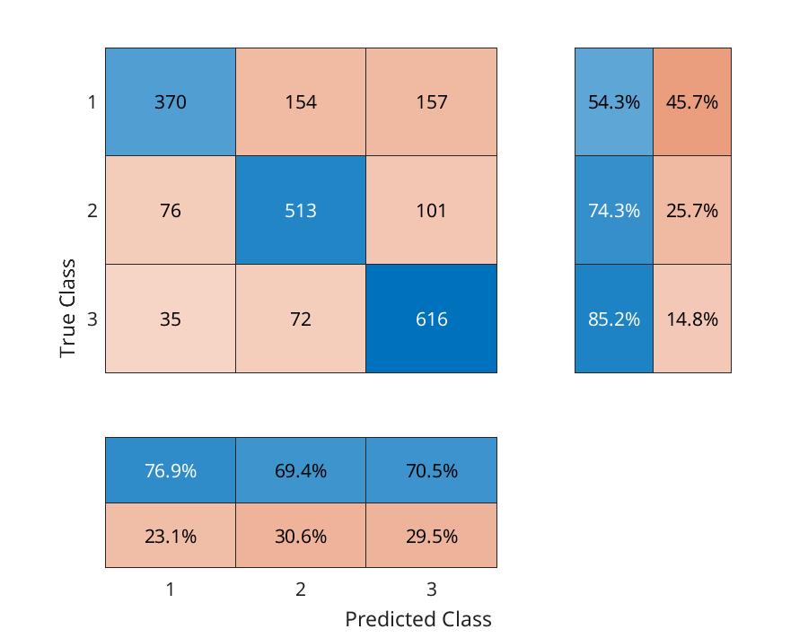

## Confusion Matrices
----

To more rigorously evaluate the effectiveness of our DARSI model in predicting gene expression from raw sequence input, we generated confusion matrices. These matrices summarize the performance of the model in terms of true positives, false positives, true negatives, and false negatives for each of the three discrete expression bins.

In the confusion matrices:
- **Columns** represent predicted expression bins:
  - 1: Zero expression
  - 2: Low expression
  - 3: High expression
- **Rows** represent actual bins as reported by measurements.

The numbers inside each matrix entry indicate the number of sequences belonging to each combination of predicted and measured gene expression bins. This provides a clear view of the model's classification performance.

### Peripheral Projections
The 2x3 and 3x2 matrices on the periphery of the confusion matrix correspond to projections from the data in each column and row:
- **Blue Numbers:** True positive rates (TPR) or true negative rates (TNR).
- **Red Numbers:** False positive rates (FPR) or false negative rates (FNR).

These projections allow for a more detailed assessment of the model's strengths and weaknesses in classification.

## Dataset

The confusion matrices are based on the MPRA dataset published by Ireland et al., 2020. Each matrix corresponds to one of the 95 *E. coli* operons analyzed in the study.

## Confusion Matrix Plots

Each confusion matrix in this directory corresponds to a specific *E. coli* operon and visualizes the DARSI model's classification performance.

### Example Plot

**Description:** This confusion matrix illustrates the performance of the DARSI model on a specific operon. Each cell in the matrix contains the count of sequences classified into a particular bin, with rows representing actual expression bins and columns representing predicted bins. The peripheral projections show true and false positive/negative rates in blue and red, respectively.

### File Format

The confusion matrices are saved as PDF files, named after their corresponding operons. For example:
- `acuI.png`
- `yqhC.png`

### Usage

These confusion matrices provide insights to:
1. Evaluate the accuracy of the DARSI model in predicting expression bins.
2. Understand classification errors across bins for individual operons.

