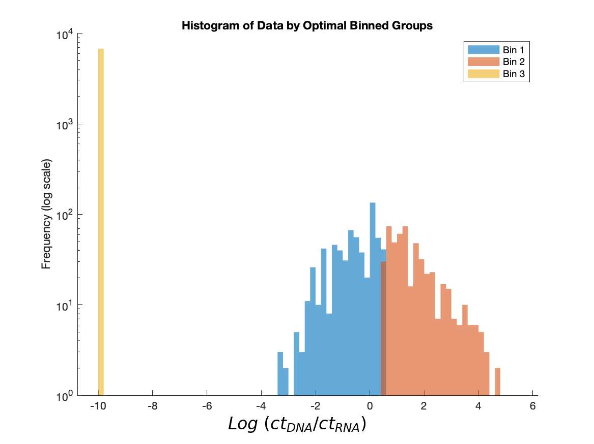

## Distribution of the mRNA Counts
----

This directory contains figures illustrating the distribution of $\\log(\\text{normalized mRNA count})$ for the analyzed operons. Each figure visualizes the distribution of expression values along with the assigned gene expression bin (zero, low, or high) for every data point.

### Key Details
- The $\\log(\\text{normalized mRNA count})$ is calculated to normalize the wide range of expression values, enabling clearer visualization and comparison across the dataset.  
- Gene expression bins are assigned based on thresholds derived from the distribution of the normalized counts, categorizing the data into distinct expression levels (zero, low, and high).  

### Important Note
While the figures may show overlap between low and high expression bins, this is purely an artifact of histogram binning used for visualization purposes. It does **not** indicate an actual overlap in the underlying expression classes.

## Dataset

The figures are based on the MPRA dataset published by Ireland et al., 2020. Each figure corresponds to one of the 95 *E. coli* operons analyzed in the study.

## Example Plot

**Description:** This example figure shows the distribution of $\\log(\\text{normalized mRNA count})$ for a specific operon. The x-axis represents the normalized expression values on a logarithmic scale, while the y-axis represents the frequency of data points. Colors indicate the assigned gene expression bins: zero (gray), low (blue), and high (red).

## File Format

The figures are saved as PDF files, named after their corresponding operons. For example:
- `acuI_expression_distribution.png`
- `yqhC_expression_distribution.png`

## Usage

These figures provide insights to:
1. Evaluate the distribution of expression data for quality control and exploratory analysis.
2. Assess the suitability of binning thresholds and their impact on downstream modeling objectives.
