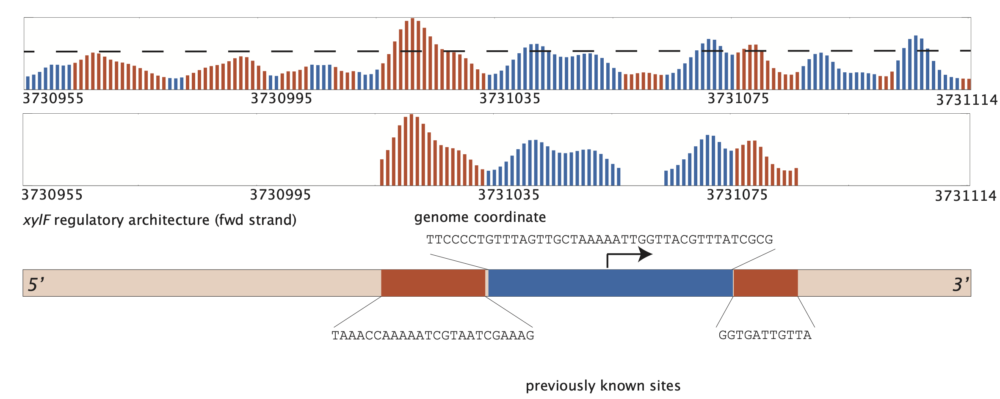

## Expression Sensitivity Plots Generated by DARSI
----

This directory contains expression plots generated using the DARSI model and saliency map approach. These plots provide insights into the regulatory architecture of *E. coli* operons by identifying regions of expression sensitivity to mutations.

### Methodology
- The test subset of the data was fed to the trained DARSI model.
- The gradient of the loss was computed with respect to each nucleotide within the sequence.
- Gradients were averaged across the entire test subset for each operon, normalized, and transformed using an exponential function.
- The results were plotted to visualize expression sensitivity to mutations.

For each operon:
- **Expression-sensitivity-to-mutation plots** are provided.
- Peaks above a predefined threshold (indicated by a dashed line) that are continuous in either repression or activation and stretch for longer than 10 bp are identified as binding sites and plotted separately.
- **Regulatory architecture cartoons** are generated based on these peaks to illustrate the identified binding sites along the operon.

### Key Details
- The genome coordinates of binding sites were extracted from RegulonDB on December 6, 2024.
- Sequences are presented in the 5' to 3' direction.
- The strand on which the regulatory architecture is located is identified in the figures.

## Dataset

The plots are based on the MPRA dataset published by Ireland et al., 2020. Each plot corresponds to one of the 95 *E. coli* operons analyzed in the study.

## Example Plot

**Description:** This figure illustrates the expression-sensitivity-to-mutation plot for the *xylF* operon. The x-axis represents the genome coordinate, and the y-axis shows normalized sensitivity. The dashed line indicates the threshold for identifying significant peaks (one standard deviation above the mean sensitivity). Peaks that stretch for longer than 10 bp and are consistent in repression or activation are marked as binding sites. Below the sensitivity plot, a cartoon shows the regulatory architecture of the operon with the identified binding sites, their sequences (5' to 3'), and the corresponding strand.

## File Format

The figures are saved as PDF files, named after their corresponding operons. For example:
- `acuI.pdf`
- `yqhC.pdf`

## Usage

These plots provide insights to:
1. Visualize the sensitivity of expression to mutations across regulatory sequences.
2. Identify transcription factor binding sites and understand the regulatory architecture of operons.

