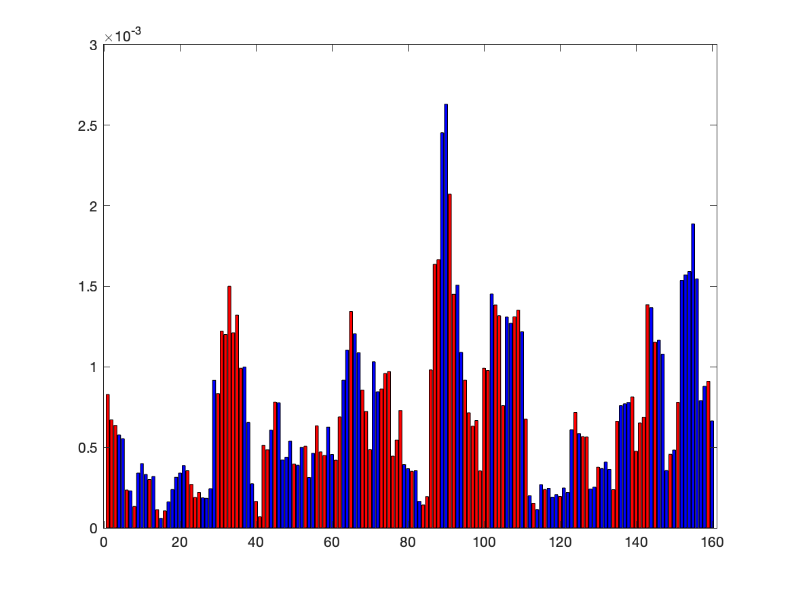

## Mutual Information Analysis
----

This directory contains subdirectories for each of the 95 *E. coli* operons. Within each subdirectory, there are 4 plots providing detailed insights into mutation information derived using methods discussed in Ireland et al., 2020.

### Methodology
- The **mutual information** between gene expression and mutations at every base pair was computed, assuming independence between base pairs.
- The **average shift in expression** was also calculated for each base pair. This was done by averaging expression values across variants mutated at a given base pair and subtracting it from the overall mean expression.

The computed shift determines whether high mutual information represents a repression domain or an activation binding site:
- **Positive Shift (Red):** Indicates a repression region. Mutations in this region increase expression.
- **Negative Shift (Blue):** Indicates an activation site. Mutations in this region decrease expression.

### Plots Overview
Each subdirectory contains the following files for a specific operon:

1. **Signed Mutual Information**
   - **EPS File:** `operon_name_signed_mutual_information.eps`
   - **PNG File:** `operon_name_signed_mutual_information.png`
   - **Description:** These plots display mutual information color-coded based on the computed shift. Red regions represent repression domains, while blue regions represent activation binding sites.

2. **Unsigned Mutual Information**
   - **EPS File:** `operon_name_unsigned_mutual_information.eps`
   - **PNG File:** `operon_name_unsigned_mutual_information.png`
   - **Description:** These plots display mutual information without color coding, providing an unprocessed view of the data.

### Example Plot

**Description:** The signed mutual information plot for the *xylF* operon. The x-axis represents positions along the regulatory sequence, and the y-axis represents mutual information. Regions are color-coded based on the computed shift: red for repression domains and blue for activation binding sites.

## File Format

Each subdirectory corresponds to a specific operon and contains the following files:
- `operon_name_signed_mutual_information.eps`
- `operon_name_signed_mutual_information.png`
- `operon_name_unsigned_mutual_information.eps`
- `operon_name_unsigned_mutual_information.png`

## Usage

These plots provide insights to:
1. Identify regions with high mutual information and understand their functional relevance.
2. Distinguish between activation and repression domains based on the computed shift.

