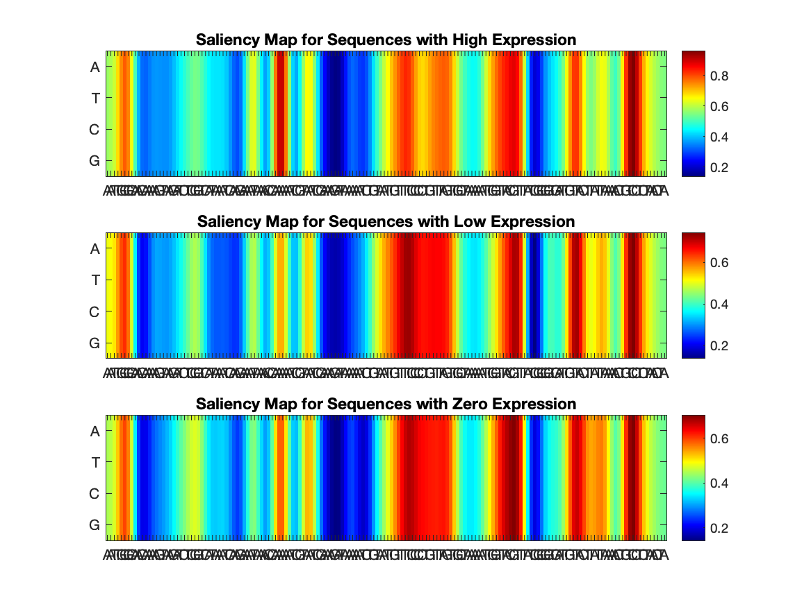

## Saliency Maps
----

This directory contains saliency maps generated by the DARSI pipeline to illustrate the sensitivity of the loss function to changes in the input layer. These maps provide insights into how different regions of the input sequence contribute to the model’s predictions. The saliency maps are based on sequences fed to a trained CNN, with a 2D input layer of dimensions 4×160.

### Methodology
1. **Model Architecture:** The input layer to the CNN model is 2D (4×160) to represent the one-hot encoded nucleotide sequences.
2. **Saliency Computation:**
   - The **gradient of the loss function** with respect to each nucleotide in the input layer was computed for the test subset.
   - These gradients were averaged across hundreds or thousands of sequence variants to generate interpretable saliency maps.
3. **Map Generation:**
   - **Per Bin Saliency Maps:** For each expression bin (zero, low, high), saliency heatmaps were averaged across sequences in the test subset.
   - **Final Saliency Map:** The maximum gradient for each base pair position was computed to generate a single summary map.

### Key Details
- The saliency maps indicate the relative sensitivity of the loss function to mutations at specific positions in the sequence.
- These maps are normalized and visualized to highlight regions with significant sensitivity, which may correspond to regulatory elements or binding sites.

## Files
Each operon has two saliency map images:
1. **Final Saliency Map:**
   - Filename: `FinalSaliencyMap_OperonName.png`
   - Description: A summary map showing the maximum sensitivity for each base pair position across all expression bins.
2. **Average Saliency Heatmaps:**
   - Filename: `SaliencyMap_OperonName.png`
   - Description: Heatmaps averaged over the test subset for each expression bin (zero, low, high). The figure contains three subplots representing the sensitivity for each bin.

## Dataset
The saliency maps are derived from the MPRA dataset published by Ireland et al., 2020. Each map corresponds to one of the 95 *E. coli* operons analyzed in the study.

## Example Plot

**Description:** The figure shows: the average saliency heatmaps for each expression bin (zero, low, high) for the *xylF* operon. Each heatmap highlights nucleotide positions that contribute most significantly to the expression classification.

## File Format
- `FinalSaliencyMap_operonname.png`
- `SaliencyMap_operonname.png`

## Usage
These saliency maps can be used to:
1. Identify regulatory elements or binding sites contributing to gene expression predictions.
2. Understand the model’s decision-making process by visualizing sensitivity patterns.

